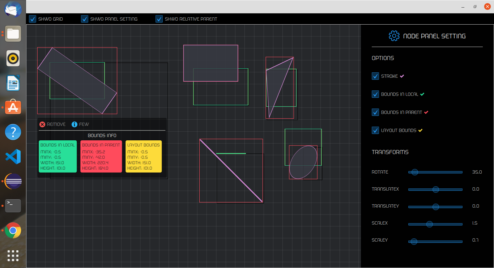

# fxBounds

fxBounds helps understanding the concept of Bounding Rectangles in javafx.

My advice is to read this https://openjfx.io/javadoc/15/javafx.graphics/javafx/scene/Node.html
part of the documentation before using fxBounds, so you get familiar with the theorie first.
